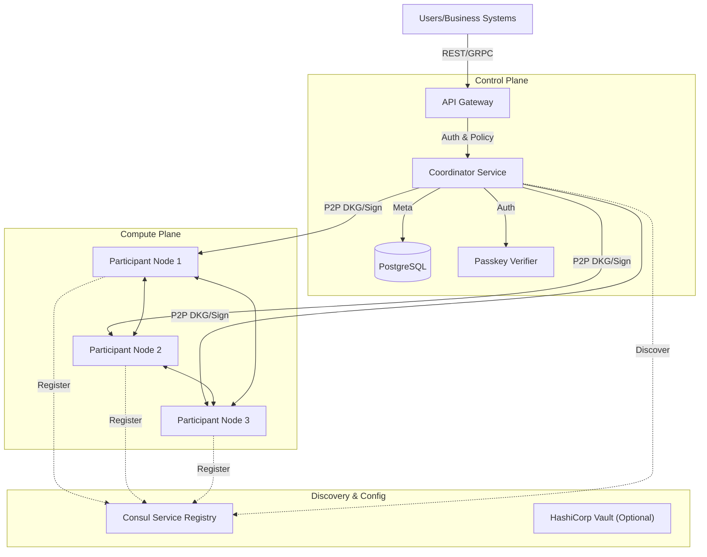

# Enterprise MPC Infrastructure
> Bank-Grade Multi-Party Computation (MPC) Digital Asset Custody Platform

[](LICENSE)
[](go.mod)

**go-mpc-infra** is an enterprise-grade MPC wallet infrastructure built on Threshold Signature Schemes (TSS). Designed for exchanges, custodians, and asset management platforms, it delivers a custody solution where **private keys never exist in complete form**, **no single point of failure exists**, and **policy-driven governance** controls digital asset operations.

Unlike traditional single-key wallets or MultiSig smart contracts, this system implements cryptographic multi-party computation at the protocol level. It natively supports any blockchain using ECDSA (Bitcoin, Ethereum) or EdDSA (Solana) signatures—no on-chain contracts required.

---

## Core Capabilities

### 1. 🔐 Bank-Grade Security Architecture
- **Distributed Key Sharding**: Private keys are split into $n$ shards the instant they're generated, then distributed across nodes in different geographic regions and cloud providers. Compromising any single node—even its database—cannot reconstruct the full key.
- **MPC Collaborative Signing**: Transaction signing requires $t+1$ nodes to compute collaboratively. Key shards never move or merge during this process; only the final signature is produced.
- **Zero-Trust Authentication**: Built-in **WebAuthn (Passkey)** standard enforces hardware-backed biometric authentication (Touch ID/Face ID/YubiKey) for management operations, eliminating API key exposure risks.

### 2. 🌐 Resilient Distributed Network
- **Decentralized Node Discovery**: Dynamic service discovery via **Consul** enables automated registration and health monitoring of compute nodes (Participants).
- **Elastic Scaling**: Stateless compute nodes support load-based horizontal scaling, automatically joining DKG (Distributed Key Generation) and signing operations.
- **High Availability**: The system remains operational even if $t$ nodes fail simultaneously.

### 3. 🛡 Policy & Risk Management Engine
- **Multi-Tier Approvals**: M-of-N administrator approval policies for critical operations (policy changes, large transfers) require multiple administrators to authorize via Passkey signatures.
- **Granular Permissions**: Role-Based Access Control (RBAC) provides precise control over member operations on wallets.

### 4. 🔗 Universal Chain Support
- **Chain Agnostic**: The underlying MPC protocol doesn't depend on any specific blockchain VM.
- **Broad Compatibility**:
    - **ECDSA (secp256k1)**: Bitcoin, Ethereum, BSC, Tron, and more.
    - **EdDSA (Ed25519)**: Solana, Aptos, Sui, Cardano, etc. (roadmap).

---

## System Architecture

The system separates control and compute planes for security and scalability:



- **Coordinator**: Handles request intake, authentication, policy enforcement, and task orchestration. Holds no key shards.
- **Participants**: Execute MPC cryptographic computations, each holding one key shard in an isolated environment.

---

## Quick Start

### Prerequisites
- Docker & Docker Compose
- Go 1.21+

### 1. Launch Infrastructure
Spin up PostgreSQL, Redis, Consul, and all MPC service nodes in one command:
```bash
make up
```

### 2. Run End-to-End System Test
The system includes a comprehensive integration test that simulates the full flow from node registration to transaction signing:
```bash
# Validates core workflow: node discovery → DKG → Passkey auth → TSS signing
go run cmd/system-test/main.go
```

### 3. API Interaction
Once services are running, explore the API via Swagger UI:
- URL: `http://localhost:8080/swagger/index.html` (requires Swagger service enabled)
- Key Endpoints:
    - `POST /v1/infra/keygen`: Initiate DKG key generation
    - `POST /v1/infra/sign`: Initiate MPC signing
    - `POST /v1/infra/wallets/{id}/policy`: Configure risk management policies

---

## Roadmap

- [x] **Phase 1: Core Foundation (Current)**
    - GG18/GG20 protocol implementation
    - Consul-based dynamic node discovery
    - WebAuthn hardware authentication
    - Basic policy engine
- [ ] **Phase 2: Enhancement & Extension**
    - FROST (Schnorr) protocol support
    - Key resharing / rotation capabilities
    - Offline signing for cold storage
- [ ] **Phase 3: Enterprise Delivery**
    - TEE (SGX/Nitro) hardware isolation support
    - Mobile app collaborative signing
    - Complete audit dashboard

## License
MIT License
