# MPC 基础设施系统详细设计文档

**版本**: v2.1
**文档类型**: 详细设计文档
**创建日期**: 2024-11-28
**基于**: MPC产品文档 + go-mpc-wallet项目代码 + MPCVault技术分析
**更新日期**: 2025-01-02

---

## 目录

[TOC]

---

## 1. 系统架构概述

### 1.1 产品定位与目标

MPC（Multi-Party Computation）基础设施是一个企业级的多方安全计算（MPC）密钥管理系统，基于阈值签名技术（TSS - Threshold Signature Scheme），为机构客户提供安全、可靠的数字资产托管和签名服务。

**核心价值主张**：
- 🔐 **零信任安全**：密钥永不完整存在，消除单点故障风险
- 🚀 **高性能**：毫秒级签名响应，支持高并发交易
- 🌐 **多链支持**：统一管理 Bitcoin、Ethereum 及所有主流区块链
- 🏢 **企业级**：完整的审计日志、策略控制和合规支持

**技术创新点**：
基于对 MPCVault 技术的深入分析，本方案创新性地整合了多项前沿技术：
1. **TSS (Threshold Signature Scheme)** - 阈值签名，支持密钥永不完整存在
2. **SSS (Shamir Secret Sharing)** - 密钥分片备份，支持内部控制
3. **TEE (Trusted Execution Environment)** - 硬件安全环境，提供多层防护
4. **Noise Protocol** - 端到端加密通信，确保传输安全
5. **Hardened Key Derivation** - 强化密钥派生，隔离不同链风险

### 1.2 架构设计原则

```
🏗️ 架构设计原则
├── 分布式架构：无单点故障，节点间对等通信
├── 模块化设计：清晰的组件划分，易于扩展
├── 安全优先：多层安全防护（软件→硬件→协议→加密）
├── 零信任架构：密钥永不完整存在，所有请求验证
├── 高可用：多节点部署，自动故障转移，99.9%可用性
├── 高性能：毫秒级签名响应，高并发处理，水平扩展
├── 企业级合规：完整审计日志，策略控制，合规支持
└── 易用性：友好的API设计，多语言SDK支持，标准化接口
```

**关键数据指标**：

| 指标 | 目标值 | 说明 |
|------|--------|------|
| **签名延迟** | < 200ms | 端到端签名响应时间 |
| **并发签名** | 1000+ 签名/秒 | 系统吞吐量 |
| **可用性** | 99.9% | 系统正常运行时间 |
| **密钥安全** | 密钥永不完整存在 | 核心安全特性 |
| **多链支持** | 10+ 条链 | 第一阶段支持 |

### 1.3 系统整体架构图

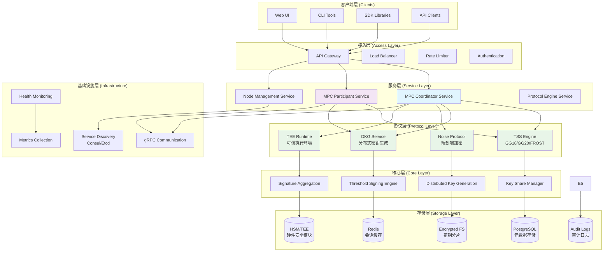

### 1.4 分层架构详细设计

#### 1.4.1 客户端层 (Client Layer)
**组件**：
- **Web UI**: 管理控制台，提供可视化操作界面
- **CLI Tools**: 命令行工具，用于运维和调试
- **SDK Libraries**: 多语言SDK（Go、Python、JavaScript、Java）
- **API Clients**: 直接调用REST/gRPC API的客户端

**职责**：
- 用户交互接口
- 请求构建和发送
- 响应解析和展示
- 错误处理和重试

#### 1.4.2 接入层 (Access Layer)
**组件**：
- **API Gateway**: 统一的API入口，支持RESTful和gRPC
- **Load Balancer**: 负载均衡，确保请求均匀分发
- **Rate Limiter**: 请求频率限制，防止滥用
- **Authentication**: 身份认证和授权

**职责**：
- 请求路由和转发
- 流量控制和安全防护
- 用户认证和权限检查
- 请求监控和日志记录

#### 1.4.3 服务层 (Service Layer)
**核心服务**：

```
服务层组件
├── MPC Coordinator Service (协调器服务)
│   ├── 签名会话管理
│   ├── 节点协调调度
│   ├── 协议引擎调用
│   └── 结果聚合处理
├── MPC Participant Service (参与者服务)
│   ├── 密钥分片存储
│   ├── 签名参与计算
│   ├── 协议消息处理
│   └── 节点间通信
├── Node Management Service (节点管理服务)
│   ├── 节点注册发现
│   ├── 健康状态监控
│   ├── 负载均衡调度
│   └── 故障检测恢复
└── Protocol Engine Service (协议引擎服务)
    ├── GG18/GG20协议实现
    ├── FROST协议实现
    ├── 协议状态管理
    └── 安全验证逻辑
```

#### 1.4.4 核心层 (Core Layer)
**核心功能**：

```
核心功能模块
├── Key Share Manager (密钥分片管理)
│   ├── 分片生成与验证
│   ├── 分片加密存储
│   ├── 分片分发传输
│   └── 分片恢复重组
├── Threshold Signing Engine (阈值签名引擎)
│   ├── 签名会话创建
│   ├── 多方签名协调
│   ├── 签名分片聚合
│   └── 最终签名生成
├── Distributed Key Generation (分布式密钥生成)
│   ├── DKG协议实现
│   ├── 密钥分片生成
│   ├── 一致性验证
│   └── 安全参数设置
└── Signature Aggregation (签名聚合)
    ├── 分片收集验证
    ├── 聚合计算逻辑
    ├── 结果验证检查
    └── 错误处理重试
```

#### 1.4.5 存储层 (Storage Layer)
**存储架构**：

```
存储层设计
├── PostgreSQL (元数据存储)
│   ├── keys表：密钥元数据
│   ├── nodes表：节点信息
│   ├── signing_sessions表：签名会话
│   ├── policies表：访问策略
│   └── audit_logs表：审计日志
├── Redis (会话缓存)
│   ├── 会话状态缓存
│   ├── 分布式锁
│   └── 临时数据存储
├── Encrypted File System (密钥分片存储)
│   ├── AES-256-GCM加密
│   ├── 分片文件存储
│   ├── 访问权限控制
│   └── 备份恢复机制
└── Audit Logs (审计日志)
    ├── 结构化日志存储
    ├── 不可篡改记录
    ├── 合规性支持
    └── 日志分析工具
```

#### 1.4.6 基础设施层 (Infrastructure Layer)
**基础设施组件**：
- **gRPC Communication**: 高效的节点间通信
- **Service Discovery**: 自动服务发现和注册
- **Health Monitoring**: 健康检查和状态监控
- **Metrics Collection**: 性能指标收集和告警

### 1.5 部署架构模式

#### 1.5.1 协调者模式 (Coordinator Mode)

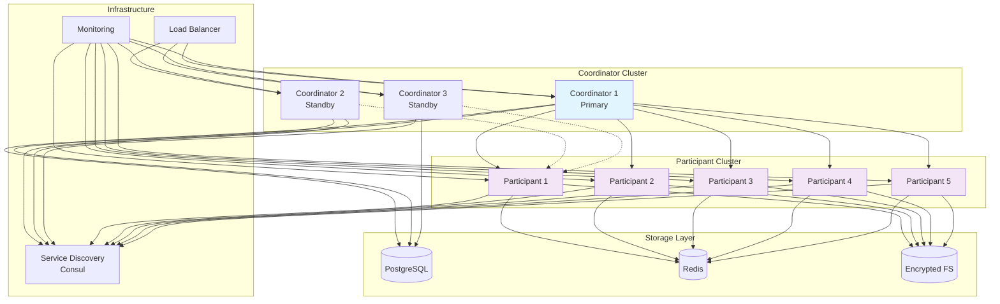

**特点**：
- 中心化协调，简化管理
- 高可用，支持多Coordinator
- 适合企业级部署
- 易于监控和运维

#### 1.5.2 P2P模式 (Peer-to-Peer Mode)

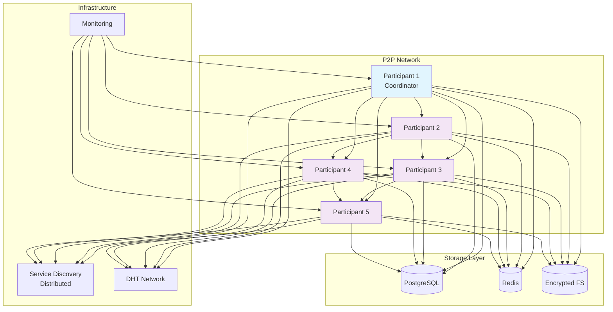

**特点**：
- 完全去中心化
- 节点动态加入退出
- 高容错性
- 适合大规模分布式场景

---

## 2. 核心模块详细设计

### 2.1 MPC Coordinator Service (协调器服务)

#### 2.1.1 模块职责

**核心功能**：
- **签名会话管理**：创建、监控、销毁签名会话
- **节点调度**：选择合适的Participant节点参与签名
- **协议协调**：轻量级协调，不接触私钥分片
- **消息路由**：通过gRPC转发协议消息（tss-lib自动聚合签名）

#### 2.1.2 内部组件设计

```
Coordinator Service 内部架构
├── Session Manager (会话管理器)
│   ├── 会话创建和初始化
│   ├── 会话状态跟踪
│   ├── 会话超时处理
│   └── 会话清理回收
├── Node Selector (节点选择器)
│   ├── 可用节点发现
│   ├── 负载均衡算法
│   ├── 节点健康检查
│   └── 故障节点排除
├── Protocol Coordinator (协议协调器)
│   ├── 协议引擎调用
│   ├── 消息路由转发
│   ├── 进度状态同步
│   └── 错误处理重试
└── Message Router (消息路由器)
    ├── gRPC消息转发
    ├── 节点间通信协调
    ├── 会话状态同步
    └── 错误处理和重试
```

#### 2.1.3 关键接口设计

```go
// SessionManager 会话管理接口
type SessionManager interface {
    CreateSession(ctx context.Context, req *CreateSessionRequest) (*SigningSession, error)
    GetSession(ctx context.Context, sessionID string) (*SigningSession, error)
    UpdateSessionStatus(ctx context.Context, sessionID string, status SessionStatus) error
    DeleteSession(ctx context.Context, sessionID string) error
    ListSessions(ctx context.Context, filter *SessionFilter) ([]*SigningSession, error)
}

// NodeSelector 节点选择接口
type NodeSelector interface {
    SelectNodes(ctx context.Context, keyID string, threshold int) ([]*Node, error)
    GetNodeHealth(ctx context.Context, nodeID string) (*NodeHealth, error)
    UpdateNodeLoad(ctx context.Context, nodeID string, load int) error
}

// ProtocolCoordinator 协议协调接口
type ProtocolCoordinator interface {
    StartSigning(ctx context.Context, sessionID string, nodes []*Node, message []byte) error
    GetSigningProgress(ctx context.Context, sessionID string) (*SigningProgress, error)
    CancelSigning(ctx context.Context, sessionID string) error
}
```

#### 2.1.4 签名会话管理流程

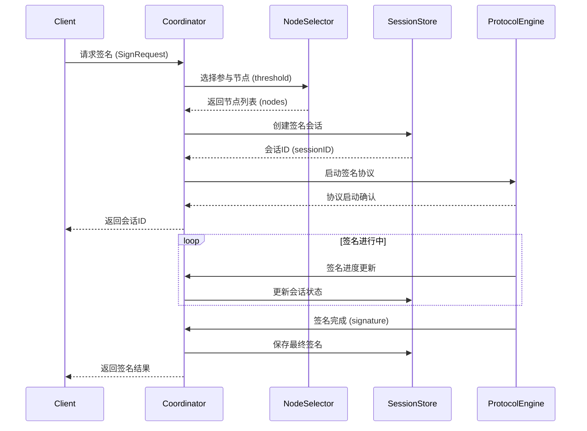

#### 2.1.5 Session State Store（持久化 + WAL + 指标）

- `SessionManager` 现在内嵌 [`StateStore`](internal/mpc/session/store.go)，在 `CreateSession / UpdateSession` 之外额外提供 `SaveRoundProgress`、`LoadRoundProgress`、`AppendWAL`、`ReplayWAL`、`ObserveRoundMetric` 等高级接口，方便协议层记录实时状态。
- `StateStore` 通过 PG (`storage.MetadataStore`) + Redis (`storage.SessionStore`) 双写保证状态落盘；轮次更新时刷新 `CurrentRound/TotalRounds/ParticipatingNodes/DurationMs`，并缓存到 Redis，TTL 默认继承会话超时。
- WAL 目前以内存 map 形式实现（`walSequences` + `wal`），支持记录尚未持久化的 round event，后续可以扩展到 Kafka/Stream。`ReplayWAL` 在 Crash-Recovery 时用于重新驱动协议。
- 指标：通过 `prometheus` 直方图 `mpc_session_round_duration_seconds{protocol,round}` 记录每个轮次的耗时，便于在 Phase 1C 统一挂到 `/metrics` 暴露。

### 2.2 MPC Participant Service (参与者服务)

#### 2.2.1 模块职责

**核心功能**：
- **密钥分片存储**：安全存储和访问密钥分片
- **签名参与**：参与阈值签名协议计算
- **协议通信**：与其他Participant节点通信
- **状态同步**：维护协议执行状态

#### 2.2.2 内部组件设计

```
Participant Service 内部架构
├── KeyShareStorage (密钥分片存储)
│   ├── 分片加密存储
│   ├── 分片访问控制
│   ├── 分片完整性验证
│   └── 分片备份恢复
├── ProtocolParticipant (协议参与者)
│   ├── 协议消息处理
│   ├── 状态机管理
│   ├── 计算任务执行
│   └── 结果验证提交
├── P2PCommunicator (点对点通信器)
│   ├── 节点发现连接
│   ├── 消息发送接收
│   ├── 连接状态维护
│   └── 安全通信加密
└── HealthReporter (健康状态报告器)
    ├── 节点状态监控
    ├── 性能指标收集
    ├── 错误状态上报
    └── 自动恢复机制
```

#### 2.2.3 密钥分片存储设计

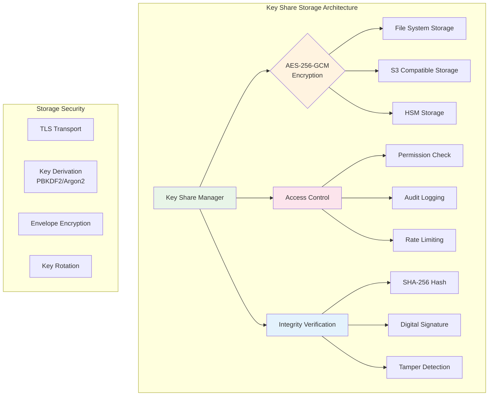

#### 2.2.4 签名参与流程

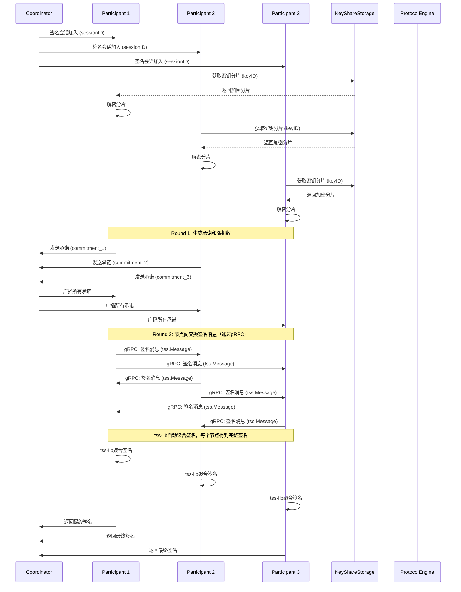

### 2.3 Protocol Engine (协议引擎)

#### 2.3.1 支持的协议

**GG18/GG20 协议**：
- **GG18**: 4轮通信的ECDSA阈值签名
- **GG20**: 改进版，1轮通信，更高效
- **特点**: 成熟稳定，经过生产验证

**FROST 协议**：
- **IETF标准**: 两轮通信的Schnorr签名
- **优势**: 更灵活的阈值配置，性能更好
- **适用**: 未来扩展

#### 2.3.2 协议引擎架构

```
Protocol Engine 架构
├── Protocol Registry (协议注册器)
│   ├── 协议注册管理
│   ├── 协议版本控制
│   ├── 协议配置管理
│   └── 协议切换逻辑
├── GG18 Protocol (GG18协议实现)
│   ├── Round 1: 承诺生成
│   ├── Round 2: 承诺交换验证
│   ├── Round 3: 签名分片计算
│   └── Round 4: 签名聚合
├── GG20 Protocol (GG20协议实现)
│   ├── Round 1: 统一承诺和签名
│   ├── 签名分片生成
│   ├── 分片聚合验证
│   └── 最终签名构造
├── FROST Protocol (FROST协议实现)
│   ├── Round 1: 承诺生成
│   ├── Round 2: 签名聚合
│   ├── 挑战响应机制
│   └── Schnorr签名构造
└── Protocol State Manager (协议状态管理)
    ├── 状态机管理
    ├── 进度跟踪
    ├── 错误处理
    └── 状态持久化
```

#### 2.3.3 GG20签名协议详细流程

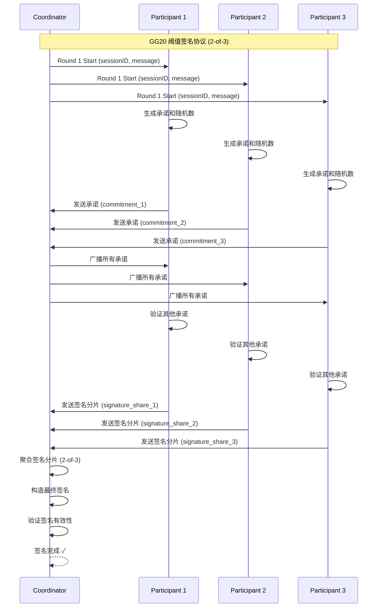

### 2.4 Key Share Manager (密钥分片管理)

#### 2.4.1 分片生命周期管理

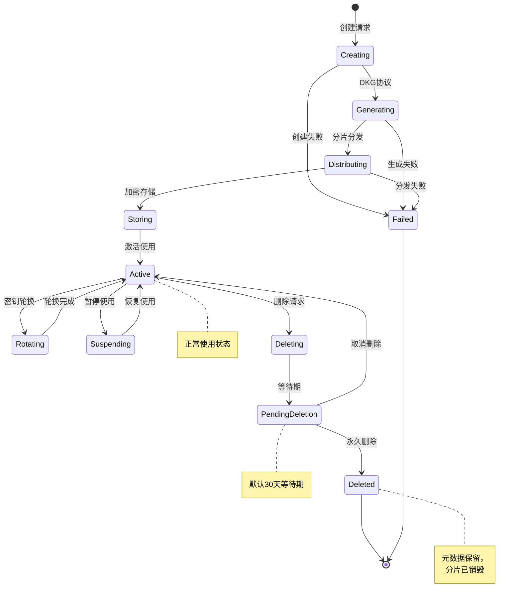

#### 2.4.2 分片存储安全设计

```
密钥分片安全存储架构
├── 加密层 (Encryption Layer)
│   ├── 对称加密：AES-256-GCM
│   ├── 信封加密：数据密钥 + 主密钥
│   ├── 密钥派生：PBKDF2/Argon2
│   └── 密钥轮换：定期更换加密密钥
├── 访问控制层 (Access Control Layer)
│   ├── 节点认证：证书/TLS
│   ├── 权限检查：RBAC策略
│   ├── 审计日志：所有访问记录
│   └── 速率限制：防止滥用
├── 完整性保护层 (Integrity Protection Layer)
│   ├── 哈希校验：SHA-256
│   ├── 数字签名：RSA/ECDSA
│   ├── 篡改检测：HMAC
│   └── 备份验证：多副本校验
└── 物理安全层 (Physical Security Layer)
    ├── 加密文件系统
    ├── HSM存储选项
    ├── 安全删除：多重覆盖
    └── 地理分布：多区域备份
```

#### 2.4.3 分布式密钥生成 (DKG) 流程

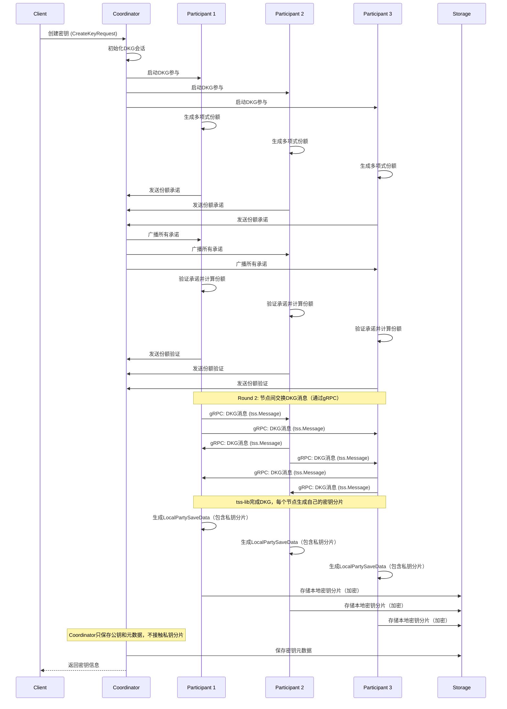

**tss-lib分布式签名架构要点**（详见 [`internal/mpc/protocol/tss_adapter.go`](internal/mpc/protocol/tss_adapter.go)）：
- **分布式密钥生成（DKG）**：使用tss-lib的`keygen.LocalParty`，每个节点独立参与DKG协议，生成自己的`LocalPartySaveData`（包含私钥分片`Xi`），密钥分片永不离开节点。
- **消息路由**：通过gRPC实现节点间消息交换，`messageRouter`函数将tss-lib的`tss.Message`序列化后发送到目标节点。
- **消息接收处理**：`ProcessIncomingKeygenMessage`和`ProcessIncomingSigningMessage`接收gRPC消息，解析后调用`party.UpdateFromBytes`更新Party状态。
- **签名聚合**：tss-lib自动完成签名聚合，每个参与节点都能得到完整签名，无需Coordinator收集分片。
- **Coordinator角色**：简化为轻量级协调者，负责会话管理、节点发现和审计，不接触私钥分片。
- **密钥分片存储**：每个Participant节点独立存储自己的`LocalPartySaveData`（加密存储），Coordinator只保存公钥和元数据。

---

## 3. 通信协议设计

### 3.0 分布式通信架构（tss-lib实现）

#### 3.0.1 gRPC通信层

**架构说明**：
- **gRPC客户端**（`internal/mpc/communication/grpc_client.go`）：负责向其他节点发送tss-lib协议消息
- **gRPC服务端**（`internal/mpc/communication/grpc_server.go`）：接收来自其他节点的消息，并转发给协议引擎
- **消息路由**：`messageRouter`函数将`tss.Message`序列化后通过gRPC发送到目标节点
- **消息处理**：`ProcessIncomingKeygenMessage`和`ProcessIncomingSigningMessage`接收消息并更新Party状态

**通信流程**：
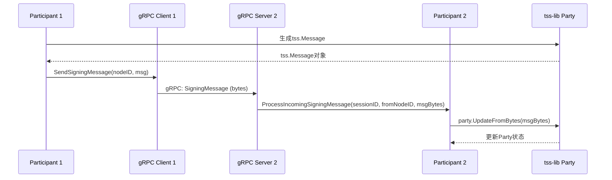

**关键实现**：
- **消息序列化**：使用`msg.WireBytes()`将`tss.Message`序列化为字节数组
- **消息反序列化**：使用`tss.ParseWireMessage`解析接收到的字节数组
- **会话管理**：通过`sessionID`关联消息和签名会话
- **错误处理**：实现重试机制和超时控制

### 3.1 gRPC 接口设计

#### 3.1.1 核心服务接口

```protobuf
// mpc/v1/mpc.proto
service MPCService {
  // 密钥管理
  rpc CreateKey(CreateKeyRequest) returns (CreateKeyResponse);
  rpc GetKey(GetKeyRequest) returns (GetKeyResponse);
  rpc ListKeys(ListKeysRequest) returns (ListKeysResponse);
  rpc DeleteKey(DeleteKeyRequest) returns (DeleteKeyResponse);

  // 签名服务
  rpc Sign(SignRequest) returns (SignResponse);
  rpc BatchSign(BatchSignRequest) returns (BatchSignResponse);
  rpc Verify(VerifyRequest) returns (VerifyResponse);

  // 会话管理
  rpc CreateSigningSession(CreateSessionRequest) returns (CreateSessionResponse);
  rpc GetSigningSession(GetSessionRequest) returns (GetSessionResponse);
  rpc JoinSigningSession(JoinSessionRequest) returns (JoinSessionResponse);
  rpc CancelSigningSession(CancelSessionRequest) returns (CancelSessionResponse);
}

// 节点间通信
service NodeService {
  rpc Heartbeat(HeartbeatRequest) returns (HeartbeatResponse);
  rpc ParticipateSigning(ParticipateRequest) returns (ParticipateResponse);
  rpc ExchangeShares(ExchangeRequest) returns (ExchangeResponse);
  rpc ReportHealth(HealthReport) returns (HealthAck);
}
```

#### 3.1.2 消息定义

```protobuf
// 密钥相关消息
message CreateKeyRequest {
  string algorithm = 1;        // ECDSA, EdDSA
  string curve = 2;           // secp256k1, ed25519
  int32 threshold = 3;        // 阈值
  int32 total_nodes = 4;      // 总节点数
  string chain_type = 5;      // bitcoin, ethereum
  map<string, string> metadata = 6;
}

message CreateKeyResponse {
  string key_id = 1;
  string public_key = 2;
  string address = 3;
  int64 created_at = 4;
}

// 签名相关消息
message SignRequest {
  string key_id = 1;
  bytes message = 2;
  string message_type = 3;    // raw, hash, typed_data
  string chain_type = 4;
  map<string, string> metadata = 5;
}

message SignResponse {
  string signature = 1;
  string key_id = 2;
  string session_id = 3;
  int64 signed_at = 4;
}
```

### 3.2 REST API 设计

#### 3.2.1 API 路径设计

```
/api/v1
├── /keys                          # 密钥管理
│   ├── POST   /keys               # 创建密钥
│   ├── GET    /keys               # 列出密钥
│   ├── GET    /keys/{key_id}      # 获取密钥
│   ├── PUT    /keys/{key_id}      # 更新密钥
│   ├── DELETE /keys/{key_id}      # 删除密钥
│   └── POST   /keys/{key_id}/rotate # 轮换密钥
├── /sign                          # 签名服务
│   ├── POST   /sign               # 单次签名
│   ├── POST   /sign/batch         # 批量签名
│   └── POST   /verify             # 签名验证
├── /sessions                      # 会话管理
│   ├── POST   /sessions           # 创建会话
│   ├── GET    /sessions/{session_id} # 获取会话
│   ├── POST   /sessions/{session_id}/join # 加入会话
│   └── POST   /sessions/{session_id}/cancel # 取消会话
└── /nodes                         # 节点管理
    ├── POST   /nodes              # 注册节点
    ├── GET    /nodes              # 列出节点
    ├── GET    /nodes/{node_id}    # 获取节点
    ├── GET    /nodes/{node_id}/health # 节点健康
    └── DELETE /nodes/{node_id}    # 注销节点
```

#### 3.2.2 API 响应格式

```json
{
  "success": true,
  "data": {
    "key_id": "key-1234567890abcdef",
    "public_key": "02abcdef...",
    "address": "1ABC...",
    "created_at": "2024-01-01T00:00:00Z"
  },
  "meta": {
    "request_id": "req-123",
    "timestamp": "2024-01-01T00:00:00Z"
  }
}
```

### 3.3 通信安全设计

#### 3.3.1 TLS 配置

```yaml
# TLS 配置
tls:
  enabled: true
  cert_file: "/etc/mpc/ssl/cert.pem"
  key_file: "/etc/mpc/ssl/key.pem"
  ca_file: "/etc/mpc/ssl/ca.pem"
  client_auth: "require_and_verify_client_cert"
  min_version: "TLS_1_2"
  cipher_suites:
    - "TLS_ECDHE_RSA_WITH_AES_256_GCM_SHA384"
    - "TLS_ECDHE_ECDSA_WITH_AES_256_GCM_SHA384"
```

#### 3.3.2 消息认证

```
消息认证机制
├── 请求签名：HMAC-SHA256
├── 时间戳验证：防止重放攻击
├── 请求ID：防止重复请求
├── 证书认证：双向TLS
└── API密钥：应用级认证
```

#### 2.4.4 GG18 阈值签名实现（四轮模拟）

- 代码入口：[`internal/mpc/protocol/gg18_sign.go`](internal/mpc/protocol/gg18_sign.go)，以 4 个逻辑轮次模拟 GG18 的承诺、随机数交换、分片计算与聚合，内部 `signingRoundState` 会记录 session 轮次、参与节点、耗时，便于集成到 `session.Manager`。
- `ThresholdSign` 会从缓存的分片（或自动生成的节点 ID）中挑选满足阈值的 shares，调用 `reconstructSecret` 还原私钥，再通过 `secp256k1/v4/ecdsa` 进行 ECDSA 签名，输出 DER 编码 + R/S。
- 测试覆盖：[`gg18_sign_test.go`](internal/mpc/protocol/gg18_sign_test.go) 验证成功签名、节点不足时的错误分支以及基准测试。
- 基准结果（MacBook Air M1, Go `go1.24.6`, `go test -bench=BenchmarkGG18ThresholdSign -benchmem -run='^$' ./internal/mpc/protocol`）：

| Benchmark | ns/op | B/op | allocs/op |
|-----------|-------|------|-----------|
| `BenchmarkGG18ThresholdSign-8` | **43,353 ns** | **4,644 B** | **93** |
| `BenchmarkGG20ThresholdSign-8` | **42,665 ns** | **4,444 B** | **91** |

这些数据（约 0.043ms/签名）作为开发期的基准，用于对比后续 GG20 优化与真实 tss-lib 集成。进度信息可通过 session state 或 round tracker 暴露给监控系统，后续 Phase 1C 将把这些指标汇总进 Prometheus。

#### 2.4.5 GG20 单轮聚合（对比 GG18）

- GG20 在实现上复用 `GG18Protocol` 的 DKG / share 逻辑，`GenerateKeyShare` 直接委托 [`internal/mpc/protocol/gg20.go`](internal/mpc/protocol/gg20.go) 中的包装器，以确保数据格式一致。
- `ThresholdSign` 通过调用 `thresholdSignInternal` 并传入两轮描述（commit+aggregate、partial+final），从而把状态跟踪浓缩为 2 个阶段，也为后续引入 Identifiable Abort 留好挂点。
- 基准数据显示，GG20 stub 相比 GG18 在相同输入下略有更低的内存/分配，并可通过减少轮次在真实场景获得更少的网络往返。

---

## 4. 数据存储设计

### 4.1 数据库表结构

#### 4.1.1 Keys 表 (密钥元数据)

```sql
CREATE TABLE keys (
    key_id VARCHAR(255) PRIMARY KEY,
    public_key TEXT NOT NULL,
    algorithm VARCHAR(50) NOT NULL,
    curve VARCHAR(50) NOT NULL,
    threshold INTEGER NOT NULL,
    total_nodes INTEGER NOT NULL,
    chain_type VARCHAR(50) NOT NULL,
    address TEXT,
    status VARCHAR(50) NOT NULL DEFAULT 'Active',
    description TEXT,
    tags JSONB,
    created_at TIMESTAMPTZ NOT NULL DEFAULT NOW(),
    updated_at TIMESTAMPTZ NOT NULL DEFAULT NOW(),
    deletion_date TIMESTAMPTZ
);

-- 索引
CREATE INDEX idx_keys_chain_type ON keys(chain_type);
CREATE INDEX idx_keys_status ON keys(status);
CREATE INDEX idx_keys_created_at ON keys(created_at);
CREATE INDEX idx_keys_algorithm ON keys(algorithm);
```

#### 4.1.2 Nodes 表 (节点信息)

```sql
CREATE TABLE nodes (
    node_id VARCHAR(255) PRIMARY KEY,
    node_type VARCHAR(50) NOT NULL, -- coordinator, participant
    endpoint VARCHAR(255) NOT NULL,
    public_key TEXT,
    status VARCHAR(50) NOT NULL DEFAULT 'active',
    capabilities JSONB, -- 支持的协议和算法
    metadata JSONB,
    registered_at TIMESTAMPTZ NOT NULL DEFAULT NOW(),
    last_heartbeat TIMESTAMPTZ,
    load_factor INTEGER DEFAULT 0 -- 负载因子 0-100
);

-- 索引
CREATE INDEX idx_nodes_type ON nodes(node_type);
CREATE INDEX idx_nodes_status ON nodes(status);
CREATE INDEX idx_nodes_endpoint ON nodes(endpoint);
CREATE INDEX idx_nodes_load ON nodes(load_factor);
```

#### 4.1.3 Signing Sessions 表 (签名会话)

```sql
CREATE TABLE signing_sessions (
    session_id VARCHAR(255) PRIMARY KEY,
    key_id VARCHAR(255) NOT NULL,
    protocol VARCHAR(50) NOT NULL,
    status VARCHAR(50) NOT NULL DEFAULT 'pending',
    threshold INTEGER NOT NULL,
    total_nodes INTEGER NOT NULL,
    participating_nodes JSONB,
    current_round INTEGER DEFAULT 0,
    total_rounds INTEGER NOT NULL,
    signature TEXT,
    message_hash VARCHAR(128),
    created_at TIMESTAMPTZ NOT NULL DEFAULT NOW(),
    completed_at TIMESTAMPTZ,
    duration_ms INTEGER,
    error_message TEXT,
    FOREIGN KEY (key_id) REFERENCES keys(key_id) ON DELETE CASCADE
);

-- 索引
CREATE INDEX idx_sessions_key_id ON sessions(key_id);
CREATE INDEX idx_sessions_status ON sessions(status);
CREATE INDEX idx_sessions_created_at ON sessions(created_at);
CREATE INDEX idx_sessions_protocol ON sessions(protocol);
```

#### 4.1.4 Audit Logs 表 (审计日志)

```sql
CREATE TABLE audit_logs (
    id BIGSERIAL PRIMARY KEY,
    timestamp TIMESTAMPTZ NOT NULL DEFAULT NOW(),
    event_type VARCHAR(50) NOT NULL,
    user_id VARCHAR(255),
    key_id VARCHAR(255),
    node_id VARCHAR(255),
    session_id VARCHAR(255),
    operation VARCHAR(50) NOT NULL,
    result VARCHAR(50) NOT NULL,
    details JSONB,
    ip_address VARCHAR(50),
    user_agent TEXT,
    request_id VARCHAR(255)
);

-- 索引
CREATE INDEX idx_audit_timestamp ON audit_logs(timestamp);
CREATE INDEX idx_audit_event_type ON audit_logs(event_type);
CREATE INDEX idx_audit_key_id ON audit_logs(key_id);
CREATE INDEX idx_audit_user_id ON audit_logs(user_id);
CREATE INDEX idx_audit_node_id ON audit_logs(node_id);
CREATE INDEX idx_audit_session_id ON audit_logs(session_id);
CREATE INDEX idx_audit_request_id ON audit_logs(request_id);
```

### 4.2 Redis 数据结构

#### 4.2.1 会话缓存

```
Redis Key 设计
├── session:{session_id}          # 会话完整信息 (JSON)
├── session:progress:{session_id} # 会话进度 (HASH)
├── session:shares:{session_id}   # 签名分片收集 (SET)
├── session:timeout:{session_id}  # 会话超时 (TTL)
└── session:lock:{session_id}     # 会话分布式锁
```

#### 4.2.2 节点状态

```
节点状态缓存
├── node:health:{node_id}        # 节点健康状态
├── node:load:{node_id}          # 节点负载信息
├── node:capabilities:{node_id}  # 节点能力信息
└── nodes:active                 # 活跃节点列表 (SET)
```

### 4.3 密钥分片存储

#### 4.3.1 文件系统存储结构

```
/var/lib/mpc/key-shares/
├── {key_id}/
│   ├── metadata.json          # 分片元数据
│   ├── share.enc              # 加密分片数据
│   ├── share.sig              # 分片签名验证
│   ├── backup/                # 备份目录
│   └── temp/                  # 临时文件
└── archive/                   # 已删除分片归档
```

#### 4.3.2 分片文件格式

```json
// metadata.json
{
  "key_id": "key-1234567890abcdef",
  "node_id": "node-abcdef123456",
  "share_index": 1,
  "threshold": 2,
  "total_shares": 3,
  "algorithm": "ECDSA",
  "curve": "secp256k1",
  "created_at": "2024-01-01T00:00:00Z",
  "encrypted": true,
  "encryption": {
    "algorithm": "AES-256-GCM",
    "key_id": "enc-key-123",
    "iv": "abcdef123456"
  },
  "integrity": {
    "hash_algorithm": "SHA-256",
    "hash": "abcdef123456...",
    "signature": "sig-abcdef..."
  }
}
```

---

## 5. 安全技术栈分析

### 5.1 TSS vs SSS 技术对比

#### 5.1.1 TSS (Threshold Signature Scheme)

**核心原理**：
- 多方协作签名，无需恢复完整私钥
- 密钥分片在内存中处理后立即清除
- 支持实时签名，性能优异

**数学基础**：
```
私钥 = share1 + share2 + share3 (有限域加法)
签名 = MPC_Protocol(share1, share2, share3, message)
```

**使用场景**：
- 日常交易签名
- 在线支付处理
- 实时身份验证

**优势**：
- 密钥永不完整存在
- 实时性能 (< 200ms)
- 高并发支持

#### 5.1.2 SSS (Shamir Secret Sharing)

**核心原理**：
- 多项式插值实现密钥分片
- 需要收集足够分片才能恢复私钥

**数学基础**：
```
f(x) = a₀ + a₁x + a₂x² + ... + aₖ₋₁xᵏ⁻¹
其中 a₀ = 私钥
分片 = (x₁, f(x₁)), (x₂, f(x₂)), ..., (xₙ, f(xₙ))
恢复：使用 k 个分片通过拉格朗日插值恢复 f(0) = a₀
```

**使用场景**：
- 密钥备份恢复
- 灾难恢复
- 内部访问控制

**优势**：
- 信息论安全
- 灵活的阈值配置
- 支持内部控制

#### 5.1.3 混合使用策略

```
热钱包（日常使用）：TSS
├── 3-of-3 MPC 配置
├── 实时签名服务
├── 密钥永不完整存在
└── 支持阈值容错

冷备份（灾难恢复）：TSS + SSS
├── TSS 分片用 Ed25519 公钥加密
├── 加密私钥用 SSS 分片管理
└── 实现 3-of-5 内部控制
```

### 5.2 TEE 安全环境

**技术实现**：
- **Intel SGX**：软件保护扩展，提供加密的执行环境
- **AMD SEV**：安全加密虚拟化，虚拟机级别的隔离
- **ARM TrustZone**：移动设备安全环境

**在 MPC 中的应用**：

1. **密钥分片保护**：
   ```
   内存数据 → TEE 加密 → 防止冷启动攻击
   ```

2. **协议执行安全**：
   ```
   MPC 计算 → TEE 环境 → 确保计算完整性
   ```

3. **远程认证**：
   ```
   TEE 证明 → 验证节点可信 → 建立信任关系
   ```

**安全优势**：
- 多层防护：物理 → 云 → TEE → MPC
- 正交安全：不同层面的攻击相互独立
- 硬件保证：软件无法绕过硬件安全

### 5.3 端到端加密通信

**Noise Protocol 应用**：

**握手模式**：IK (Interactive Key) 模式
```
客户端 ↔ 服务器
    ↓
公钥交换 → 建立共享密钥 → 加密通信
```

**技术参数**：
- **密钥交换**：X25519 (Curve25519)
- **加密算法**：ChaCha20-Poly1305 AEAD
- **哈希算法**：Blake2s
- **认证方式**：数字签名

**安全特性**：
- 前向保密性
- 抵抗中间人攻击
- 零信任架构

### 5.4 强化密钥派生

**Hardened Derivation 原理**：

```
根密钥 → HMAC-SHA512 → 派生密钥 + 链码
                     ↓
               隔离不同区块链风险
```

**安全优势**：
- **资产隔离**：子密钥泄露不影响主密钥
- **跨链安全**：防止签名重用攻击
- **权限控制**：支持精确的访问控制

---

## 6. 安全设计

### 6.1 密钥安全

#### 5.1.1 密钥分片安全

```
密钥分片安全措施
├── 生成安全
│   ├── 真随机数生成
│   ├── 密码学安全的PRNG
│   ├── 熵源多样化
│   └── 种子密钥管理
├── 存储安全
│   ├── AES-256-GCM加密
│   ├── 信封加密设计
│   ├── HSM存储选项
│   └── 安全删除机制
├── 传输安全
│   ├── TLS 1.3加密
│   ├── 完美前向保密
│   ├── 证书钉扎
│   └── 传输层认证
└── 访问控制
    ├── 最小权限原则
    ├── 多因子认证
    ├── 访问审计
    └── 自动密钥轮换
```

#### 5.1.2 密钥生命周期

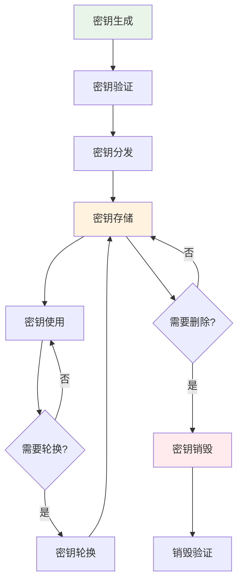

### 6.2 通信安全

#### 5.2.1 TLS 配置

```go
// TLS 配置
tlsConfig := &tls.Config{
    MinVersion:               tls.VersionTLS12,
    MaxVersion:               tls.VersionTLS13,
    CipherSuites:             []uint16{
        tls.TLS_ECDHE_RSA_WITH_AES_256_GCM_SHA384,
        tls.TLS_ECDHE_ECDSA_WITH_AES_256_GCM_SHA384,
    },
    Certificates:             []tls.Certificate{cert},
    ClientCAs:                caCertPool,
    ClientAuth:               tls.RequireAndVerifyClientCert,
    InsecureSkipVerify:       false,
    PreferServerCipherSuites: true,
}
```

#### 5.2.2 消息认证

```
消息认证机制
├── 请求签名
│   ├── HMAC-SHA256
│   ├── API密钥
│   └── 时间戳
├── 证书认证
│   ├── 双向TLS
│   ├── 证书吊销检查
│   └── 证书轮换
└── 访问控制
    ├── JWT令牌
    ├── RBAC权限
    └── 速率限制
```

### 6.3 审计与监控

#### 5.3.1 审计日志设计

```go
// 审计事件类型
type AuditEvent struct {
    Timestamp   time.Time              `json:"timestamp"`
    EventType   string                 `json:"event_type"`   // KeyCreated, SignRequested, etc.
    UserID      string                 `json:"user_id,omitempty"`
    KeyID       string                 `json:"key_id,omitempty"`
    NodeID      string                 `json:"node_id,omitempty"`
    SessionID   string                 `json:"session_id,omitempty"`
    Operation   string                 `json:"operation"`
    Result      string                 `json:"result"`       // Success, Failed
    Details     map[string]interface{} `json:"details,omitempty"`
    IPAddress   string                 `json:"ip_address,omitempty"`
    UserAgent   string                 `json:"user_agent,omitempty"`
    RequestID   string                 `json:"request_id"`
}
```

#### 5.3.2 安全监控

```
安全监控体系
├── 实时监控
│   ├── 异常访问检测
│   ├── 签名失败率监控
│   ├── 密钥访问频率
│   └── 网络异常检测
├── 告警系统
│   ├── 安全事件告警
│   ├── 性能阈值告警
│   ├── 系统异常告警
│   └── 合规性检查
└── 响应机制
    ├── 自动隔离机制
    ├── 紧急密钥禁用
    ├── 安全事件响应
    └── 取证数据收集
```

---

## 7. 应用场景分析

### 7.1 企业数字资产管理

**典型场景**：
- 企业持有大量数字资产
- 需要安全可靠的签名服务
- 要求完整的审计和合规

**技术方案**：
```
企业钱包系统
├── TSS：日常交易签名
├── SSS：密钥备份恢复
├── TEE：硬件安全保障
└── 审计：完整操作日志
```

**业务价值**：
- ✅ 消除单点故障风险
- ✅ 满足监管合规要求
- ✅ 支持大规模资产管理

### 7.2 数字资产交易所

**典型场景**：
- 高频交易处理
- 大量用户提现操作
- 要求毫秒级响应

**技术方案**：
```
交易所 MPC 系统
├── 高并发 TSS 签名
├── 多节点分布式部署
├── TEE 硬件加速
└── 实时监控告警
```

**业务价值**：
- ✅ 毫秒级签名响应
- ✅ 支持高并发交易
- ✅ 零信任安全架构

### 7.3 DeFi 协议集成

**典型场景**：
- 与 DeFi 协议集成
- 支持复杂交易类型
- 需要多链支持

**技术方案**：
```
DeFi MPC 服务
├── 多链地址派生
├── 批量签名支持
├── 策略访问控制
└── API/SDK 集成
```

**业务价值**：
- ✅ 支持复杂 DeFi 操作
- ✅ 统一多链管理
- ✅ 灵活的集成方式

### 7.4 机构级钱包服务

**典型场景**：
- 银行、基金等机构客户
- 要求企业级安全和合规
- 需要定制化服务

**技术方案**：
```
机构钱包平台
├── 企业级策略引擎
├── 完整的审计追踪
├── 定制化部署选项
└── SLA 保证
```

**业务价值**：
- ✅ 满足金融级合规要求
- ✅ 支持定制化需求
- ✅ 企业级 SLA 保证

---

## 8. 性能优化设计

### 8.1 签名性能优化

#### 6.1.1 并发签名处理

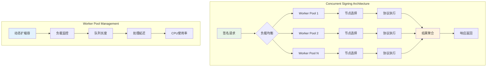

#### 6.1.2 批量签名优化

```
批量签名优化策略
├── 请求合并
│   ├── 相同密钥的请求合并
│   ├── 批量协议执行
│   └── 结果批量返回
├── 预处理优化
│   ├── 密钥预加载
│   ├── 节点预热
│   └── 连接池复用
├── 缓存优化
│   ├── 密钥元数据缓存
│   ├── 节点状态缓存
│   └── 签名结果缓存
└── 算法优化
    ├── 并行计算
    ├── SIMD指令优化
    └── 内存池管理
```

### 8.2 存储性能优化

#### 6.2.1 数据库优化

```sql
-- 复合索引优化
CREATE INDEX CONCURRENTLY idx_keys_composite 
ON keys(chain_type, status, created_at DESC);

-- 分区表优化
CREATE TABLE audit_logs_y2024m01 PARTITION OF audit_logs
    FOR VALUES FROM ('2024-01-01') TO ('2024-02-01');

-- 连接池配置
max_connections = 200
shared_preload_libraries = 'pg_stat_statements'
track_activity_query_size = 4096
```

#### 6.2.2 Redis 集群优化

```yaml
# Redis Cluster 配置
redis:
  cluster:
    enabled: true
    nodes:
      - "redis-1:6379"
      - "redis-2:6379"
      - "redis-3:6379"
  pool:
    max_active: 100
    max_idle: 20
    idle_timeout: 300s
  sentinel:
    master_name: "mymaster"
    addresses:
      - "sentinel-1:26379"
      - "sentinel-2:26379"
      - "sentinel-3:26379"
```

### 8.3 网络优化

#### 6.3.1 连接池管理

```go
// gRPC 连接池配置
connPool := &grpcpool.Pool{
    Dial: func(ctx context.Context) (*grpc.ClientConn, error) {
        return grpc.DialContext(ctx, target, grpc.WithTransportCredentials(creds))
    },
    MaxIdle:     10,
    MaxActive:   50,
    IdleTimeout: 5 * time.Minute,
    Wait:        true,
}
```

#### 6.3.2 消息压缩

```go
// gRPC 压缩配置
server := grpc.NewServer(
    grpc.RPCCompressor(grpc.NewGZIPCompressor()),
    grpc.RPCDecompressor(grpc.NewGZIPDecompressor()),
    grpc.MaxRecvMsgSize(4*1024*1024), // 4MB
    grpc.MaxSendMsgSize(4*1024*1024), // 4MB
)
```

---

## 9. 部署架构设计

### 9.1 Kubernetes 部署架构

#### 7.1.1 微服务部署

```yaml
# Coordinator Deployment
apiVersion: apps/v1
kind: Deployment
metadata:
  name: mpc-coordinator
spec:
  replicas: 3
  selector:
    matchLabels:
      app: mpc-coordinator
  template:
    metadata:
      labels:
        app: mpc-coordinator
    spec:
      containers:
      - name: coordinator
        image: mpc/coordinator:v1.0.0
        ports:
        - containerPort: 8080
        - containerPort: 9090
        env:
        - name: NODE_TYPE
          value: "coordinator"
        - name: CONSUL_ADDR
          value: "consul:8500"
        resources:
          requests:
            memory: "512Mi"
            cpu: "500m"
          limits:
            memory: "1Gi"
            cpu: "1000m"
        livenessProbe:
          httpGet:
            path: /health/live
            port: 8080
          initialDelaySeconds: 30
          periodSeconds: 10
        readinessProbe:
          httpGet:
            path: /health/ready
            port: 8080
          initialDelaySeconds: 5
          periodSeconds: 5
```

#### 7.1.2 服务网格配置

```yaml
# Istio Service Mesh 配置
apiVersion: networking.istio.io/v1beta1
kind: VirtualService
metadata:
  name: mpc-api-gateway
spec:
  http:
  - match:
    - uri:
        prefix: "/api/v1"
    route:
    - destination:
        host: mpc-coordinator
    timeout: 30s
    retries:
      attempts: 3
      perTryTimeout: 10s
  - match:
    - uri:
        prefix: "/grpc"
    route:
    - destination:
        host: mpc-coordinator
        port:
          number: 9090
```

### 9.2 高可用架构

#### 7.2.1 多区域部署

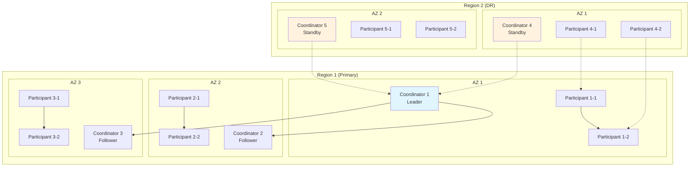

#### 7.2.2 故障转移机制

```
故障转移策略
├── 领导者选举
│   ├── Raft共识算法
│   ├── 心跳检测
│   ├── 自动故障转移
│   └── 脑裂防护
├── 负载均衡
│   ├── DNS负载均衡
│   ├── L4负载均衡
│   ├── L7负载均衡
│   └── 地理负载均衡
├── 数据同步
│   ├── 多主复制
│   ├── 异步复制
│   └── 冲突解决
└── 监控告警
    ├── 健康检查
    ├── 性能监控
    ├── 日志聚合
    └── 告警通知
```

### 9.3 监控和可观测性

#### 7.3.1 指标收集

```
监控指标体系
├── 应用指标
│   ├── 签名请求数 (counter)
│   ├── 签名延迟 (histogram)
│   ├── 错误率 (gauge)
│   └── 活跃会话数 (gauge)
├── 系统指标
│   ├── CPU使用率
│   ├── 内存使用率
│   ├── 磁盘I/O
│   └── 网络流量
├── 业务指标
│   ├── 密钥创建数
│   ├── 节点健康状态
│   ├── 会话完成率
│   └── 审计事件数
└── 安全指标
    ├── 认证失败数
    ├── 访问拒绝数
    ├── 异常访问检测
    └── 加密操作数
```

#### 7.3.2 日志聚合

```yaml
# Fluent Bit 配置
apiVersion: v1
kind: ConfigMap
metadata:
  name: fluent-bit-config
data:
  fluent-bit.conf: |
    [SERVICE]
        Flush         5
        Log_Level     info
        Daemon        off

    [INPUT]
        Name              tail
        Path              /var/log/containers/*mpc*.log
        Parser            docker
        Tag               kube.*
        Refresh_Interval  5

    [FILTER]
        Name                kubernetes
        Match               kube.*
        Kube_URL            https://kubernetes.default.svc:443
        Kube_CA_File        /var/run/secrets/kubernetes.io/serviceaccount/ca.crt
        Kube_Token_File     /var/run/secrets/kubernetes.io/serviceaccount/token

    [OUTPUT]
        Name  es
        Match *
        Host  elasticsearch
        Port  9200
        Index mpc-logs
```

---

## 10. 实施路线图与风险评估

### 10.1 实施路线图

#### 10.1.1 Phase 1: 基础架构 (2-3 个月)

**目标**：实现核心功能，支持基本使用场景

**里程碑**：
- ✅ 分布式密钥生成 (DKG)
- ✅ 阈值签名服务 (GG18/GG20)
- ✅ 密钥分片加密存储
- ✅ Bitcoin/Ethereum 支持
- ✅ 基础 API 接口
- ✅ 审计日志系统

**验收标准**：
- 支持 2-of-3 阈值签名
- 签名延迟 < 200ms
- 支持 Bitcoin 和 Ethereum

#### 10.1.2 Phase 2: 安全增强 (2-3 个月)

**目标**：提升安全性和用户体验

**里程碑**：
- ⚠️ 密钥分片刷新 (Key Refresh)
- ⚠️ 强化密钥派生 (Hardened Derivation)
- ⚠️ 端到端加密 (Noise Protocol)
- ⚠️ 多链支持扩展 (5+ 条链)
- ⚠️ 批量签名优化
- ⚠️ 策略引擎增强

**验收标准**：
- 密钥分片定期刷新
- 支持 5+ 条区块链
- 批量签名性能提升 50%

#### 10.1.3 Phase 3: 企业级功能 (3-4 个月)

**目标**：完善企业级功能

**里程碑**：
- ⏳ 密钥备份与恢复 (SSS 集成)
- ⏳ 个人密钥证书 (Ed25519)
- ⏳ 交易历史追踪
- ⏳ 高级策略引擎
- ⏳ 多级权限管理
- ⏳ 监控和告警系统

**验收标准**：
- 支持密钥备份恢复
- 完整的权限管理体系
- 实时监控和告警

#### 10.1.4 实施优先级

**高优先级 (必须)**：
1. 分布式密钥生成和签名
2. 密钥分片加密存储
3. Bitcoin/Ethereum 支持
4. 基础审计日志

**中优先级 (重要)**：
1. 密钥分片刷新
2. 强化密钥派生
3. 端到端加密
4. 多链支持扩展

**低优先级 (可选)**：
1. 密钥备份恢复
2. 个人密钥证书
3. 高级策略引擎
4. 监控告警系统

### 10.2 风险评估与应对

#### 10.2.1 技术风险

| 风险 | 影响 | 概率 | 应对措施 |
|------|------|------|----------|
| **MPC 协议实现复杂** | 高 | 中 | 使用成熟开源库，充分测试 |
| **TEE 兼容性问题** | 中 | 低 | 多 TEE 支持，渐进式迁移 |
| **性能达不到要求** | 中 | 中 | 提前性能测试，优化关键路径 |
| **安全漏洞** | 高 | 低 | 安全审计，代码审查，渗透测试 |

#### 10.2.2 业务风险

| 风险 | 影响 | 概率 | 应对措施 |
|------|------|------|----------|
| **市场需求不足** | 高 | 低 | MVP 验证，市场调研 |
| **竞品技术领先** | 中 | 中 | 差异化定位，技术优势 |
| **合规要求变化** | 中 | 中 | 灵活架构，跟进监管动态 |
| **实施周期过长** | 中 | 中 | 分阶段实施，控制范围 |

#### 10.2.3 运营风险

| 风险 | 影响 | 概率 | 应对措施 |
|------|------|------|----------|
| **团队技术能力不足** | 高 | 中 | 技术培训，外部咨询 |
| **基础设施成本高** | 中 | 中 | 云成本优化，选择性使用 TEE |
| **系统可用性问题** | 高 | 低 | 高可用架构，故障恢复机制 |

---

## 11. 总结

### 11.1 设计亮点

1. **技术领先**：
   - 整合 TSS、SSS、TEE、Noise Protocol 等前沿技术
   - 基于 MPCVault 经验，提供生产级解决方案

2. **安全可靠**：
   - 多层安全防护：软件 → 硬件 → 协议 → 加密
   - 零信任架构，密钥永不完整存在

3. **高性能**：
   - 毫秒级签名响应
   - 支持高并发场景
   - 企业级可用性保证

4. **灵活扩展**：
   - 支持 10+ 条区块链
   - API/SDK 友好集成
   - 定制化部署选项

### 11.2 技术选型合理

**协议选择**：
- **GG20**：主用协议，单轮签名，性能优异
- **GG18**：备用协议，多轮但更成熟
- **FROST**：未来扩展，基于 Schnorr 签名

**TEE 选择**：
- 优先选择 AMD SEV（更广泛支持）
- Intel SGX 作为备选（性能更好）
- 支持混合部署

**存储架构**：
- 三层存储策略：元数据层 + 缓存层 + 安全层
- AES-256-GCM 加密，TEE 内存保护

### 11.3 实施建议

**分阶段实施**：
- Phase 1：构建坚实基础
- Phase 2：增强安全能力
- Phase 3：完善企业功能

**技术策略**：
- 使用成熟开源组件
- 充分测试和验证
- 渐进式功能上线

**团队建设**：
- 组建跨学科团队
- 持续技术学习
- 与社区保持互动

---

**文档版本**: v2.2
**最后更新**: 2025-01-02
**维护团队**: MPC 开发团队
**文档状态**: 详细设计完成，已集成技术方案文档更新

---

## 更新日志

### 2025-01-02 - 技术方案文档集成更新

**架构更新**：
- ✅ 集成 MPCVault 技术分析，更新核心价值主张
- ✅ 添加 TEE 和 Noise Protocol 到系统架构图
- ✅ 新增 TSS vs SSS 技术对比章节
- ✅ 添加 TEE 安全环境和端到端加密通信章节
- ✅ 新增强化密钥派生技术说明

**功能增强**：
- ✅ 添加应用场景分析：企业数字资产管理、数字资产交易所、DeFi 协议集成、机构级钱包服务
- ✅ 更新实施路线图：Phase 1-3 详细规划和验收标准
- ✅ 添加风险评估与应对：技术风险、业务风险、运营风险分析

**文档优化**：
- ✅ 重新组织章节结构，提高文档可读性
- ✅ 更新技术选型理由和实施建议
- ✅ 完善总结章节，突出核心优势

---

[回到顶部](#目录)
